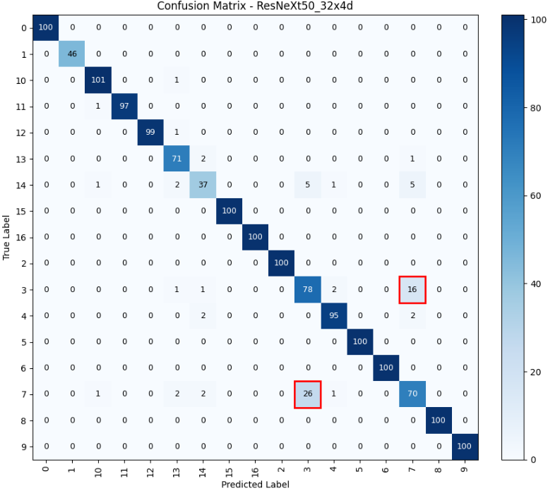
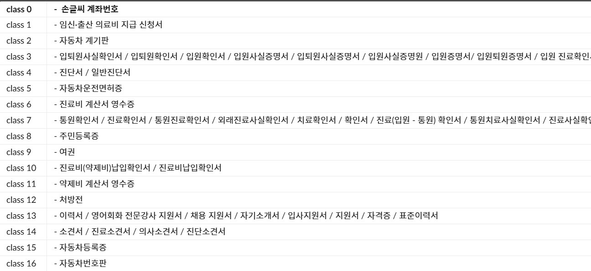
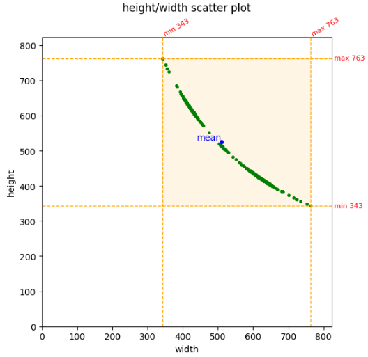
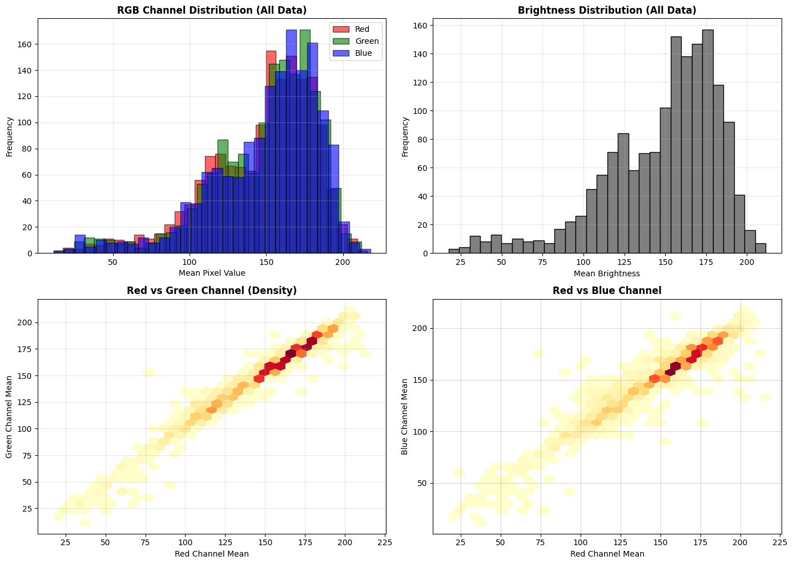
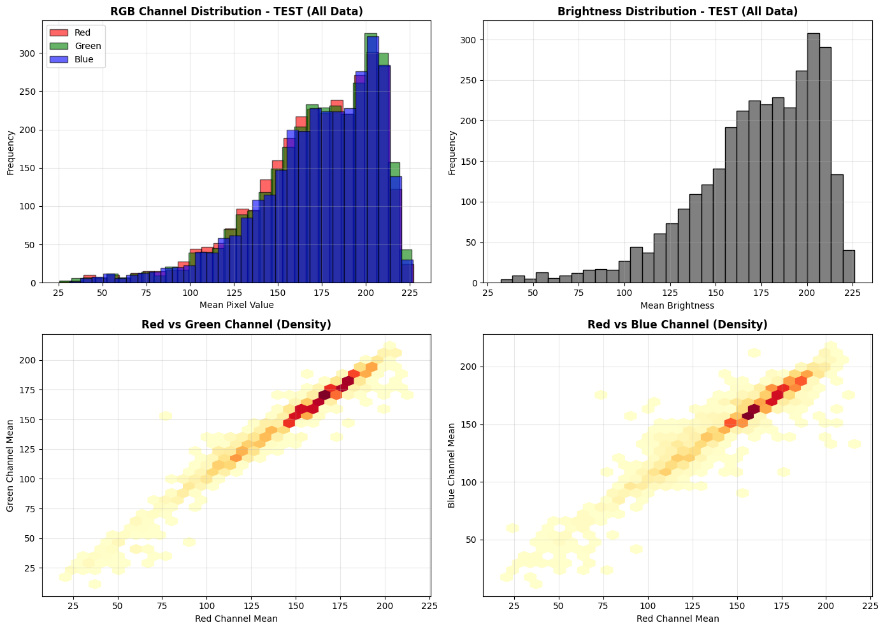
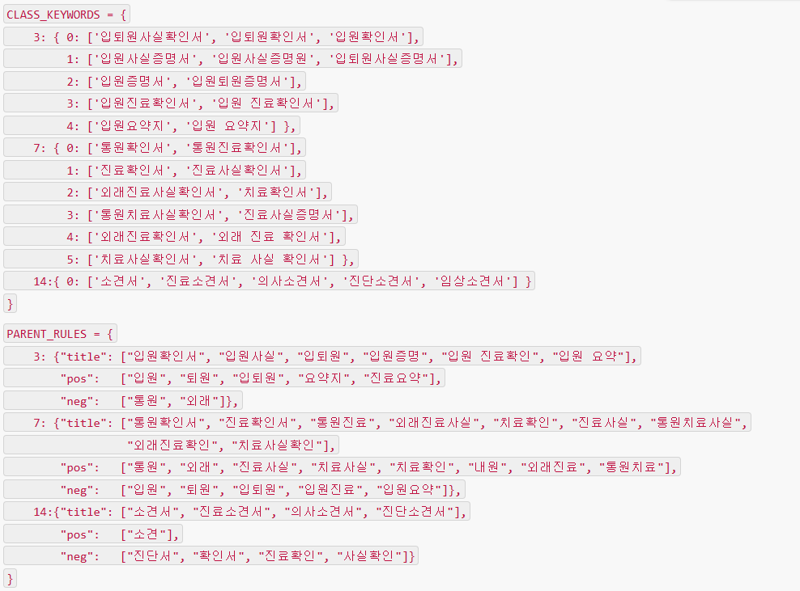

# 🧾**Document Type Classification**
## **[HighFive]** 어려워도 힘들어도 소통하며 문제해결하자!


|  |  |  |  |  |  |
| :--------------------------------------------------------------: | :--------------------------------------------------------------: | :--------------------------------------------------------------: | :--------------------------------------------------------------: | :--------------------------------------------------------------: | :--------------------------------------------------------------: |
|            [김종화](https://github.com/JHKIM-ItG)             |            [박준영](https://github.com/juny79)             |            [권효주](https://github.com/hopeplanting)             |            [안현태](https://github.com/TeethChatterDev)             |            [권문진](https://github.com/moongs95)             |            [최보경](https://github.com/bekky1016)             |
|                            팀장, 모델설계 및 테스트                             |                            모델 설계 및 테스트                             |                            모델 설계 및 테스트                             |                            EDA 및 전처리                             |                            EDA 및 전처리                             |                            EDA 및 전처리                             |


---

## 0️⃣ Overview

---

문서 이미지를 분석하여 자동으로 문서 유형
(예: **입퇴원서**, **진료확인서**, **신분증**, **영수증** 등)을 분류하는
**딥러닝 기반 문서 분류 시스템(Deep Learning–based Document Classification System)** 을 개발하였습니다.

---

### ⚙️ **Environment**

| 항목                        | 내용                 |
| ------------------------- | ------------------ |
| **Language**              | Python 3.10        |
| **Version Control**       | Git                |
| **Environment Isolation** | `requirements.txt` |
| **Reproducibility**       | Random seed 고정     |

---

### 📦 **Requirements**

> 본 프로젝트는 다음과 같은 주요 라이브러리를 기반으로 개발되었습니다.

| 분류                             | 라이브러리          |
| ------------------------------ | -------------- |
| **Deep Learning Framework**    | PyTorch        |
| **Model Zoo / Backbone**       | Timm           |
| **Data Augmentation**          | Albumentations |
| **Machine Learning Utilities** | scikit-learn   |
| **Data Handling**              | pandas         |
| **Image Processing**           | OpenCV         |


---

## 1️⃣ **Competition Info**

---

### 🏁 **Overview**

해당 대회는 **문서 이미지 내의 다양한 유형**
(예: **입·퇴원서**, **진료확인서**, **신분증**, **영수증** 등)을
자동으로 인식하고 분류하는 것을 목표로 합니다.

이를 통해 **병원·행정·기업의 문서 처리 자동화**를 촉진하는
**딥러닝 기반 문서 분류 시스템**을 구축합니다.

---

### ⏰ **Timeline**

| 구분        | 일정             |
| --------- | -------------- |
| **Start** | 🗓️ 2025.10.31 |
| **End**   | 🏁 2025.11.12  |

---

> 💡 **Goal:**
> 실제 환경에서 다양한 문서 유형을 안정적으로 인식할 수 있는
> **고성능·범용 문서 분류 모델**을 개발하는 것.

---


## 2️⃣ Components

### Directory

```
├── EDA/
│   ├── EDA_Distribution.ipynb
│   └── EDA_moongs95.ipynb
├── baseline/
│   ├── baseline_jhkim.ipynb
│   ├── baseline_moongs95_efficent_kfold_aug_v5.ipynb
│   └── hyoentae-experiment/
├── config/
│   ├── base.yaml
│   └── exp_with_routing.yaml
├── data/
│   └── readme.txt
├── source/
│   └── main.py
├── src/
│   ├── __init__.py
│   ├── predict.py
│   ├── train.py
│   └── transforms.py
├── requirements.txt
└── README.md
```


## 3️⃣ **Data Description**

### 📊 **Dataset Overview**

해당 프로젝트는 **문서 이미지 분류**를 위한 데이터셋을 사용하였습니다.

| 구분        | 개수     | 특이사항                                                                 |
| --------- | ------ | -------------------------------------------------------------------- |
| **Train** | 1,570장 | 노이즈와 회전이 없는 **정방향의 깨끗한 이미지**                                         |
| **Test**  | 3,140장 | 흐림(blur), mixup, 회전(rotation) 등이 적용된 이미지로, **Train 대비 약 15% 밝은 이미지** |

---

### 🧩 **특징 요약**

* **Train 데이터:**
  명확하고 정제된 이미지로 구성되어 있어 **모델의 기본 패턴 학습**에 적합합니다.
* **Test 데이터:**
  다양한 변형(blur, rotation, mixup, brightness)이 포함되어 있으며, **일반화 성능 평가**에 중점을 둡니다.


---

## 4️⃣ **EDA (Exploratory Data Analysis)**

---

### 🧭 **EDA 프로세스 개요**

본 프로젝트의 EDA는 **문서 이미지 분류 모델의 성능 저하 원인**을 규명하기 위해
데이터의 **분포, 품질, 클래스 구성, 시각적 특성**을 단계적으로 분석하는 과정으로 진행하였습니다.

---

### 1️⃣ **데이터 불균형 및 Domain Shift 분석**


#### 📊 **분석 과정**

* 클래스별 샘플 수를 집계하여 불균형 정도를 파악


#### 📈 **결론**

* 일부 클래스(`resume`, `statement_of_opinion`, `application_for_payment`)의 **샘플 수가 현저히 적음**


---

### 2️⃣ **클래스 간 혼동 및 F1 분석**


#### 📊 **분석 과정**

* 혼동행렬(Confusion Matrix)을 통해 클래스 간 오분류 관계 분석
* 클래스별 F1 score을 계산하여 취약 클래스 식별

#### 📈 **결론**

* **Class 3 ↔ Class 7** 간 상호 오분류 빈도 높음 (약 16~25%)
* 3, 7, 14 클래스의 F1 score가 현저히 낮음 → **시각적 유사성과 데이터 다양성 부족이 원인**

---

### 3️⃣ **클래스 내부 다양성(Intra-Class Variation) 분석**



#### 📊 **분석 과정**

* 각 클래스 내 샘플을 시각적으로 확인하고 문서 제목/양식 비교
* 문서 형태 및 구조적 일관성 검토

#### 📈 **결론**

* 단일 클래스 내에서도 **서로 다른 문서 형식**이 혼재되어 있음

  * ex. Class 3: 입퇴원사실확인서, 입원증명서 등
  * Class 7: 통원·진료·치료확인서
  * Class 13: 이력서, 지원서, 자기소개서
* 동일 라벨 내 구조적 다양성이 커서 **모델 혼란도 증가**

---

### 4️⃣ **이미지 크기 및 종횡비 분석**
#### Image size 


#### 📊 **분석 과정**

* Train/Test 이미지의 평균 해상도, 비율(Width/Height) 비교

#### 📈 **결론**

| 항목     | Train     | Test      |
| ------ | --------- | --------- |
| 평균 해상도 | 497×538px | 517×519px |
| 형태     | 세로로 긴 형태  | 정사각형에 가까움 |

> 단순 Resize 시 **비율 왜곡 가능성**이 있음 → 향후 전처리 시 종횡비 유지 필요성 도출

---

### 5️⃣ **밝기 및 색상 분포 분석**

#### Train RGB

#### Test RGB


#### 📊 **분석 과정**

* RGB 채널별 평균 및 분포 시각화
* 밝기 히스토그램을 통해 노출 정도 분석

#### 📈 **결론**

* RGB 채널 간 색상 편향은 없음 (R≈G≈B)
* **Test 데이터가 평균적으로 15~20% 더 밝음** → 조도 편향 존재
* 색감보다는 **명암(밝기)** 차이가 주요 요인

---

### 6️⃣ **시각적 비교 및 패턴 관찰**

#### 📊 **분석 과정**

* Train/Test 샘플을 직접 시각적으로 비교
* 조명, 각도, 배경, 텍스트 선명도 등을 항목별로 구분

#### 📈 **결론**

| 구분     | Train     | Test        |
| ------ | --------- | ----------- |
| 조명     | 균일, 중간 밝기 | 과노출, 반사광 다수 |
| 각도     | 정면        | 기울기·회전 다양   |
| 배경     | 단색        | 다양한 배경      |
| 텍스트 명암 | 선명        | 흐림·왜곡 빈번    |

> Train 대비 Test는 **촬영 환경 변동이 크고 조도 불안정성** 존재 → 실제 환경 적응력 필요

---

### 7️⃣ **OCR 기반 텍스트 분석 (탐색적 시도)**


#### 📊 **분석 과정**

* OCR(EasyOCR)을 활용해 문서 상단 텍스트 추출
* 텍스트 기반으로 클래스 내 문서 제목·양식의 차이 검증

#### 📈 **결론**

* 동일 클래스 내에서도 **서브 카테고리(Sub-class)** 존재
* OCR을 통해 문서 제목 수준의 추가 정보를 활용할 수 있음을 확인
  → 이후 **보조 분류 시스템 설계의 근거**로 활용

---

### 🧩 **최종 EDA 결론 요약**

| 주요 관찰 항목     | 핵심 결론                     |
| ------------ | ------------------------- |
| 데이터 불균형      | 특정 클래스 샘플 수 부족            |
| Domain Shift | Train/Test 간 밝기·노이즈 차이 존재 |
| 클래스 혼동       | 3↔7, 7↔14 간 시각적 유사성 높음    |
| 내부 다양성       | 동일 클래스 내 문서 양식 불일치        |
| 밝기 편향        | Test 이미지 평균 밝기 15~20% 높음  |
| 구조 차이        | 해상도·비율·각도 불일치             |
| OCR 탐색       | Sub-class 구분 가능성 확인       |

---

> 🧠 **결론적으로**, 본 EDA를 통해 데이터셋이 **작고 불균형하며 Domain Shift가 심한 구조**임을 확인하였으며,
> 이러한 편향과 구조적 다양성이 **모델 성능 저하의 주요 원인**임을 규명했습니다.
> 또한 OCR 텍스트를 통한 **세부 문서 단위 구분 가능성(Sub-class)** 을 발견하여
> 이후 모델 개선의 핵심 단서로 활용하였습니다.

---


## 5️⃣ **Data Processing**

---

### ⚙️ **Overview**

본 단계에서는 **데이터 품질 개선 및 모델 입력 일관성 확보**를 위해
이미지 전처리, 정규화, 증강(Augmentation) 과정을 체계적으로 수행하였습니다.
또한 **Train-Test 간 Domain Shift**를 완화하고,
실제 환경의 다양한 문서 상태(회전·밝기·노이즈)를 반영할 수 있도록 설계되었습니다.

---

### 1️⃣ **Data Cleaning & Standardization**

#### 🧹 **Noise 제거 및 기하학적 보정**

* **Deskew (기울기 교정)**

  * 문서 스캔 시 발생하는 기울어진 이미지를 보정
  * Train 데이터의 50%, Test 데이터의 100%에 적용
  * → 텍스트 수평 정렬을 통해 OCR 및 모델의 인식 정확도 향상

#### 🧾 **해상도 통일 및 비율 유지**

* **512×512** 크기로 리사이즈
* 문서 종횡비가 달라지는 왜곡 방지를 위해 **Padding(255, 흰색 배경)** 사용
* → 다양한 문서 비율을 가진 데이터에서도 일관된 입력 유지

#### 💡 **밝기 및 대비 조정 (CLAHE)**

* LAB 색공간의 **L 채널**에만 적용하여 세부 명암도 향상
* Train 데이터의 50%, Test 데이터의 100% 적용
* → 반사광·과노출 환경에서 문서 텍스트 가독성 개선

#### 🔢 **정규화 (Normalization)**

* 픽셀 값을 **[-1, 1] 범위**로 정규화
* 평균 및 표준편차: `mean = (0.5, 0.5, 0.5)`, `std = (0.5, 0.5, 0.5)`
* → 모델 입력 분포 안정화 및 학습 안정성 확보

---

### 2️⃣ **Data Augmentation (Train Only)**

| 증강 기법                    | 확률  | 목적               |
| ------------------------ | --- | ---------------- |
| RandomShadow             | 30% | 조명 변화 및 반사광 대응   |
| RandomBrightnessContrast | 40% | 명암 조정으로 조도 편향 완화 |
| ImageCompression         | 30% | 저화질 문서 대응        |
| GaussNoise               | 30% | 노이즈 상황 학습        |
| Perspective              | 30% | 문서 각도·원근 왜곡 학습   |
| Rotate (±8°)             | 50% | 회전된 문서 시뮬레이션     |

> 🎯 **목적:** 1,570장의 소규모 데이터셋에서 Test 환경을 **가상으로 재현**하여
> 일반화(Generalization) 성능을 극대화.

---

### 3️⃣ **Data Labeling**

* 주어진 라벨은 클래스별 문서 타입(`입퇴원서`, `진료확인서`, `영수증` 등)에 따라 부여
* OCR 분석 결과를 참고해 일부 클래스 내 **Sub-class 식별 기준** 수립 (예: `입원요약지 → subclass 34`)
* 해당 Sub-class 정보는 **추론 단계 보조 분류 시스템**에서 활용

---

### 4️⃣ **Pipeline Design**

* 전처리 과정 전체를 **모듈화(Python 함수 단위)** 로 구현

  * `deskew()`, `apply_clahe()`, `resize_with_padding()` 등
* Albumentations 라이브러리를 활용하여 GPU 기반으로 증강 처리
* **재현성 확보:** `seed = 42` 고정
* **일관성 유지:**

  * Train → 증강 중심
  * Test → 보정 중심 (증강 미적용)

---

### 🧩 **결론**

> 데이터 전처리는 단순한 이미지 변환을 넘어,
> **Domain Shift 완화**, **조도 균일화**, **문서 구조 보정**을 중심으로 설계되었습니다.
> 이를 통해 입력 이미지의 일관성을 확보하고,
> 소규모 데이터 환경에서도 **강건한 학습 성능(robustness)** 을 달성하였습니다.

---


## 6. Modeling

### 🧱 프로젝트 구조
```
configs/
 └── temp_full_mult4_tta4.yaml     # 전체 파이프라인 설정 파일

src/
 ├── transforms.py                 # 이미지 전처리·증강 정의
 ├── train.py                      # K-Fold 학습 및 검증
 └── predict.py                    # 추론(TTA) + Fold 앙상블

outputs/
 ├── fold0/best.pt ... fold4/best.pt  # Fold별 최적 가중치
 ├── submission.csv                  # 최종 예측 결과
 └── predict_logits.pt               # 분석용 Logits 저장
```
### ⚙️ 학습/추론 파이프라인 개요
#### 🔧 1) 설정 파일 → 전체 파이프라인 제어

temp_full_mult4_tta4.yaml

* 이미지 크기(img_size)

* 교차 검증(n_splits=5)

* 데이터 증강 배수(aug_multiplier=4)

* 모델 종류(convnext_tiny.fb_in22k_ft_in1k)

* 학습 옵션(epoch, lr, scheduler, mixup 등)

* 추론 옵션(TTA=4)

* 출력 경로(out_dir)

모든 하이퍼파라미터는 이 파일 하나로 관리합니다.

#### 🏋️‍♂️ 2) 학습 (train.py)
전체 프로세스
```
YAML 설정 로드 → 시드 고정 → K-Fold 분할(5)
   ↓
Fold별 데이터셋 생성
   ↓
Albumentations 기반 전처리 + RepeatAug(×4)
   ↓
ConvNeXt-Tiny 모델 생성 (timm)
   ↓
AMP + Mixup + Cosine LR + Class Weight
   ↓
Early Stopping → foldN/best.pt 저장
```

주요 기능

* StratifiedKFold(5) 교차 검증

* RepeatAugDataset: 데이터셋을 4배 확장

* MixUp(alpha=0.2)

* Automatic Mixed Precision (GPU 최적화)

* Gradient Clipping

* Class Imbalance 보정(weight="balanced")

* Early stopping(patience=3)

#### 🔍 3) 전처리·증강 (transforms.py)

문서 이미지 최적화 전처리 + 확률적 증강 적용.

##### 핵심 전처리

* Deskew(기울기 보정)

* CLAHE(대비 향상)

* Unsharp Masking(선명화)

* Letterbox(비율 유지 리사이즈, 640×640)

##### 학습용 Stochastic Augmentation

* Affine / Perspective

* Blur / MotionBlur / MedianBlur

* GaussNoise / ISONoise

* Brightness/Contrast

* Normalize(ImageNet mean/std)

##### 검증·추론용 전처리 (증강 없음)

* Deskew + CLAHE + Unsharp

* Normalize 후 Tensor 변환

#### 🚀 4) 추론 + Fold 앙상블 (predict.py)
프로세스
```
Valid transform 적용
   ↓
fold0~4/best.pt 가중치 로드
   ↓
TTA(0°,90°,180°,270° 회전)
   ↓
각 Fold의 logits 평균
   ↓
최종 라벨 선택
   ↓
submission.csv 저장
   ↓
predict_logits.pt 저장
```
특징

* Rotation TTA(4-way)

* Fold별 logits 평균 앙상블

* 자동 컬럼 감지(id, filename 등)

* 분석용 logits + 이미지 ID 저장

### 📁 temp_full_mult4_tta4.yaml (주요 설정)
```
seed: 42
device: auto
num_workers: 0

data:
  img_size: 640
  n_splits: 5
  folds: [0,1,2,3,4]
  aug_multiplier: 4
  tta: 4

model:
  name: convnext_tiny.fb_in22k_ft_in1k
  pretrained: true
  dropout: 0.1
  label_smoothing: 0.05

train:
  epochs: 12
  batch_size: 32
  lr: 3e-4
  weight_decay: 1e-4
  scheduler: cosine
  early_stop_patience: 3
  amp: true
  mixup_alpha: 0.2
  class_weight: balanced
```

### ▶️ 실행 방법
학습
```
python src/train.py --config configs/temp_full_mult4_tta4.yaml
```

Fold별로 다음이 생성됨:
```
outputs/full_mult4_tta4/fold0/best.pt
...
outputs/full_mult4_tta4/fold4/best.pt
```
추론(TTA=4)
```
python src/predict.py --config configs/temp_full_mult4_tta4.yaml --tta 4
```

출력 파일:
```
outputs/full_mult4_tta4/submission.csv
outputs/full_mult4_tta4/predict_logits.pt
```

### 🧩 전체 파이프라인 요약 다이어그램
```
temp_full_mult4_tta4.yaml
        │
        ▼
[ train.py ]
 ├── StratifiedKFold(5)
 ├── get_train_transforms()
 ├── RepeatAug ×4
 ├── Mixup + AMP + AdamW
 ├── Early Stopping
 └── save foldN/best.pt
        │
        ▼
[ predict.py ]
 ├── get_valid_transforms()
 ├── Load fold0~4 best.pt
 ├── Rotation TTA (4-way)
 ├── Logits 평균 앙상블
 └── submission.csv 저장
```
### 🏁 결론

이 프로젝트는 문서 이미지 분류에서 요구되는:

* 문서 이미지 특화 전처리(Deskew/CLAHE)

* 강력한 증강 전략(RepeatAug ×4, MixUp)

* ConvNeXt Tiny 백본 활용

* K-Fold + TTA 앙상블

을 모두 포함한 End-to-End 고성능 파이프라인입니다.


## 7. Result

### 📊 Leaderboard 성능 요약
| File | Strategy | F1 Score |
|------|----------|----------|
| **submission_26_44elmg.csv** | Stage 1–2 (Easy-Lock + Meta-Gate) | ⭐ **0.9634** |
| submission_26_44elmgtgpr.csv | Stages 1–4 전체 적용 | 0.9628 |
| **Final OCR Conditional Ensemble** | Stage 1–2 + OCR 보조 분류 | 🌟 **0.9683** |

---

### 🚀 4단계 게이트형 개선 전략

#### 1) Easy-Lock  
고확신 클래스(0,2,5,8,9,15,16)를 보호 (34.9%)

#### 2) Meta-Gate  
엔트로피 > 1.4, 확률 마진 < 0.10인 불확실 샘플만 메타 모델 적용 (1.2%)

#### 3) Text-Gate  
3↔7, 4↔14 초근접 클래스에만 텍스트 기반 보정 (0.4%)

#### 4) Pair Refiner  
극도로 근접한 페어만 미세 조정

---

### ❗ 핵심 결론
- 보정 단계를 많이 적용할수록 성능이 하락  
- **Stage 1–2만 적용한 전략이 최고 성능(F1=0.9634)**  
- 최소 개입 원칙이 가장 안정적

---

### 🔍 OCR 기반 Conditional Ensemble (최종 성능 향상 핵심)

#### 적용 클래스: 3, 7, 14  
- EasyOCR 기반 텍스트 추출  
- Crop/Rotation/Flip/Otsu 전처리  
- 텍스트 기반 Sub-class 매핑

#### Ensemble Logic
- OCR 인식 성공 → OCR 결과 사용  
- 인식 실패 → 기존 SOTA 모델 예측 유지  

#### 결과
- 기존 최고: **0.9634**  
- **OCR 적용 후: 0.9683 (+0.0049)**

---

### 📑 Presentation
🔗 https://docs.google.com/presentation/d/1_s5--4S6BSyY_0GM227u9oa35uPCx0u0/edit?slide=id.g37012ab8176_8_622


## etc

### Meeting Log

- [_Insert your meeting log link like Notion or Google Docs_](https://www.notion.so/HighFive-29abb811b377809694a6c55a530cf710)

### Reference

- 노이즈 제거 및 기울기 보정(Deskewing)
- CNN (Convolutional Neural Network)
- Deep Learning for Technical Document Classification (2021)
- Document-Image-Classification-with-Intra-Domain-Transfer-Learning
- OCR 없이 end-to-end로 문서를 이해하는 모델로, 시각 정보와 텍스트 정보 동시 학습
- Document image analysis and recognition: a survey (2022)
- DiT (Document Image Transformer)
- Kaggle - Documents Classification Using CNN

